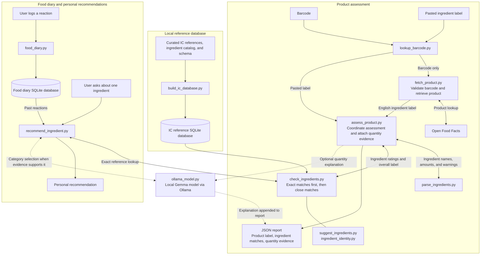

# IC Food App architecture

```mermaid
flowchart TB
    subgraph Scan["Product assessment"]
        Barcode["Barcode"] --> CLI["lookup_barcode.py"]
        Label["Pasted ingredient label"] --> CLI
        CLI -->|Barcode only| Fetch["fetch_product.py<br/>Validate barcode and retrieve product"]
        Fetch <-->|Product lookup| OFF["Open Food Facts"]
        Fetch -->|English ingredient label| Assess["assess_product.py<br/>Coordinate assessment and attach quantity evidence"]
        CLI -->|Pasted label| Assess
        Assess <-->|Ingredient names, amounts, and warnings| Parse["parse_ingredients.py"]
        Assess <-->|Ingredient ratings and overall label| Check["check_ingredients.py<br/>Exact matches first, then close matches"]
        Check --- Helpers["suggest_ingredients.py<br/>ingredient_identity.py"]
        Assess --> Report["JSON report<br/>Product label, ingredient matches, quantity evidence"]
    end

    subgraph Data["Local reference database"]
        Seed["Curated IC references, ingredient catalog, and schema"]
        Seed --> Build["build_ic_database.py"]
        Build --> Ref[("IC reference SQLite database")]
    end

    subgraph Diary["Food diary and personal recommendations"]
        Reaction["User logs a reaction"] --> Log["food_diary.py"]
        Log --> DiaryDB[("Food diary SQLite database")]
        Ingredient["User asks about one ingredient"] --> Recommend["recommend_ingredient.py"]
        DiaryDB -->|Past reactions| Recommend
        Recommend <-->|Exact reference lookup| Check
        Recommend --> Rec["Personal recommendation"]
    end

    Ref --> Check
    Assess -.->|Optional quantity explanation| Model["ollama_model.py<br/>Local Gemma model via Ollama"]
    Model -.->|Explanation appended to report| Report
    Recommend <-.->|Category selection when evidence supports it| Model
```
